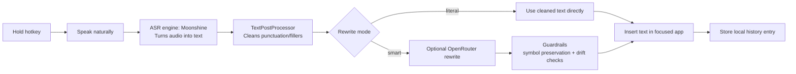
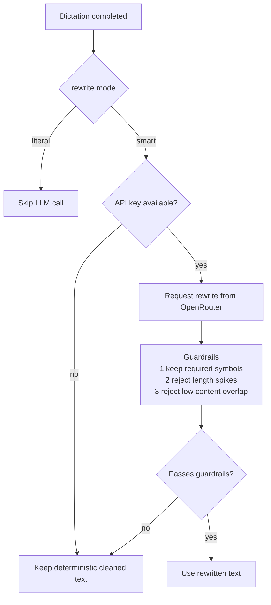
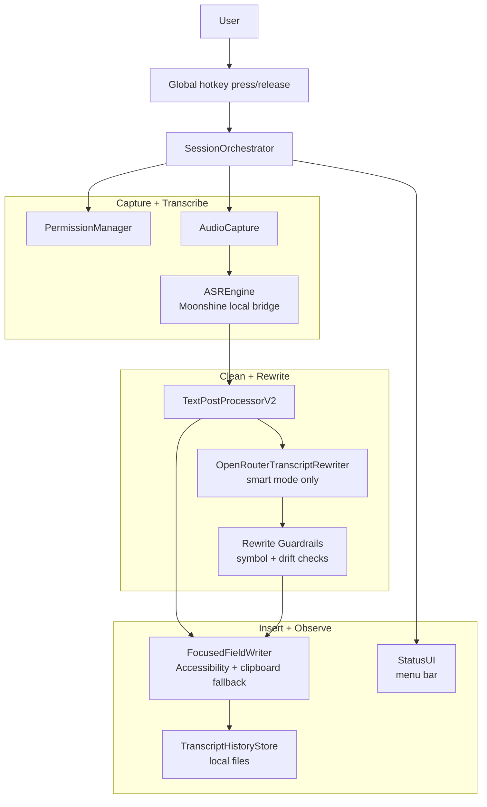

# Murmur

Local-first macOS dictation with push-to-talk, local ASR (Moonshine), and reliable text insertion.


`Murmur` is designed to work immediately without cloud setup:
- Default rewrite mode is `literal` (no LLM token required).
- Optional `smart` rewrite uses OpenRouter when configured.
- Runtime path stays local-first and falls back safely on failure.

## Quick Start

```bash
git clone git@github.com:acrucetta/murmur.git
cd murmur
./murmur install
murmur run
```

Usage flow:
1. Focus any text field.
2. Hold the hotkey (`ctrl+shift+space` by default).
3. Speak, then release.
4. Murmur inserts cleaned text.

Visual flow (plain English + technical labels):



Quick glossary:
- `ASR` (Automatic Speech Recognition): speech-to-text conversion.
- `SessionOrchestrator`: the "traffic controller" that coordinates capture, rewrite, and insertion.
- `Guardrails`: rewrite checks for symbol preservation (`!`, `?`, `@`), length spike rejection, and content-overlap rejection.

Background mode:

```bash
murmur start
murmur logs
murmur stop
```

## Requirements

- macOS 13+
- Swift toolchain (Xcode Command Line Tools is enough)
- Python 3 (for Moonshine runtime setup)
- Internet access on first install only (dependencies + model download)

## Installation

Recommended:

```bash
./murmur install
```

This installer:
- creates/reuses `.venv`
- installs Moonshine Python dependencies
- downloads the English Moonshine model
- builds `MurmurMenuBarApp`
- installs global `murmur` command

Runtime ASR is local-only by default (`scripts/moonshine_transcribe.py --offline` via app runtime). If local model assets are missing, Murmur fails fast instead of downloading at dictation time.

Useful options:

```bash
./murmur install --python /absolute/path/to/python3
./murmur install --skip-model-download
./murmur install --link-only
```

If `murmur` is not in `PATH` after install, add `~/.local/bin` to `PATH`.

## Rewrite Modes

`Murmur` supports two rewrite modes:

- `literal` (default): deterministic cleanup only, no LLM rewrite.
- `smart`: deterministic cleanup + optional OpenRouter rewrite.

Default behavior:
- If you do nothing, Murmur runs in `literal` mode.
- No API key is required for the default path.

Mode decision flow:



Enable smart mode:

```bash
export OPENROUTER_API_KEY="<your-token>"
export MURMUR_REWRITE_MODE="smart"
export MURMUR_OPENROUTER_MODEL="mistralai/mistral-small-3.1-24b-instruct"
murmur run
```

One-off mode override:

```bash
murmur run --rewrite-mode literal
murmur run --rewrite-mode smart --openrouter-model mistralai/mistral-small-3.1-24b-instruct
```

## Configuration

Interactive wizard:

```bash
murmur config
```

Use this as the primary configuration path. New settings should land here first.

Manual CLI (reference/fallback):

```bash
murmur config set --shortcut "ctrl+option+space"
murmur config set --reset-shortcut
murmur config set --mode smart --model mistralai/mistral-small-3.1-24b-instruct
murmur config set --pause-media true
murmur config set --microphone "MacBook Pro Microphone"
murmur config set --reset-microphone
murmur config set --api-key "<token>"
murmur config set --clear-api-key
```

Config precedence:
1. CLI flags (`--rewrite-mode`, `--openrouter-model`, etc.)
2. Environment variables (`MURMUR_*`, `OPENROUTER_API_KEY`)
3. Config files in `~/Library/Application Support/Murmur`
4. Built-in defaults (`literal` mode, default model id)

Media pause behavior:
- Optional setting: `pause_media_while_recording` (`false` by default).
- When enabled, Murmur uses a deterministic volume strategy: snapshot current output volume/mute, set output volume to `0` while recording, then restore prior volume/mute on release.
- In menu-bar runtime, changing this setting in the menu applies immediately (no app restart needed).
- You can also override with `MURMUR_PAUSE_MEDIA_WHILE_RECORDING=true|false`.

Microphone selection:
- Optional setting: `microphone` (`system_default` by default).
- Set by name or UID in config: `murmur config set --microphone "<name-or-uid>"`.
- Inspect available devices: `murmur microphones`.
- Reset to OS default input: `murmur config set --reset-microphone`.
- You can also override with `MURMUR_MICROPHONE="<name-or-uid>"`.

## Logging and Grep

Background log file:

```bash
/tmp/murmur-menubar.log
```

Log format is structured and grep-friendly:

```text
ts=2026-02-18T12:34:56.789Z level=info metric release_to_insert_ms=183
ts=2026-02-18T12:34:56.790Z level=info metric insert_text chars=24 preview="hello world from murmur"
ts=2026-02-18T12:34:56.791Z level=info metric insert_result success=true method=accessibility_direct code=none
ts=2026-02-18T12:34:57.111Z level=info metric smart_rewrite_usage model=... turn_total_tokens=...
```

Common filters:

```bash
rg "metric release_to_(final|insert)_ms=" /tmp/murmur-menubar.log
rg "metric insert_(text|result)" /tmp/murmur-menubar.log
rg "metric smart_rewrite_" /tmp/murmur-menubar.log
rg "metric media_control_" /tmp/murmur-menubar.log
rg "metric media_control_volume_" /tmp/murmur-menubar.log
rg "level=info warning=" /tmp/murmur-menubar.log
```

## History and Clipboard Behavior

Murmur stores local completion history in system files under:

- `~/Library/Application Support/Murmur/transcriptions/YYYY-MM-DD.txt` (daily entries)
- `~/Library/Application Support/Murmur/transcriptions/completions.log` (append-only completion log)

Clipboard fallback behavior:

- When Murmur uses clipboard paste insertion, the dictated text remains on the clipboard after paste.
- This allows clipboard history tools to retain the inserted dictation text.

## CLI Reference

```bash
murmur run [--model <id>] [--rewrite-mode <literal|smart>] [--openrouter-model <id>] [--pause-media-while-recording <true|false>] [--microphone <name-or-uid>]
murmur start [--model <id>] [--rewrite-mode <literal|smart>] [--openrouter-model <id>] [--pause-media-while-recording <true|false>] [--microphone <name-or-uid>]
murmur stop
murmur logs
murmur microphones
murmur config
murmur config set [--shortcut <combo>] [--reset-shortcut] [--mode literal|smart] [--model <id>] [--pause-media <true|false>] [--microphone <name-or-uid>] [--reset-microphone] [--api-key <token>] [--clear-api-key]
murmur doctor
murmur install [--python <python3>] [--skip-model-download] [--link-only]
murmur uninstall
```

Help:

```bash
murmur --h
murmur config --h
```

## Development

Build and test:

```bash
swift build
swift test
```

Useful code paths:
- Core orchestrator: `Sources/DictationAppCore/Core/SessionOrchestrator.swift`
- Rewrite module: `Sources/DictationAppCore/Modules/Rewrite/`
- Menu bar app entry: `Sources/MurmurMenuBarApp/main.swift`
- Launcher script: `scripts/murmur`

## Troubleshooting

- Hotkey does nothing:
  - Verify `Microphone`, `Accessibility`, and `Input Monitoring` permissions.
- ASR fails:
  - Run `murmur doctor`.
  - Confirm Python path + Moonshine script resolution.
  - Run `murmur microphones` and bind a known-good input with `murmur config set --microphone "<name-or-uid>"`.
- Smart rewrite not applying:
  - Confirm mode is `smart`.
  - Confirm API key is present (`murmur doctor` shows key presence/source).
- Insertion fails in secure fields:
  - This is expected in protected input contexts.

## Architecture



## Docs

- Docs index: `docs/index.md`
- Product specs: `docs/product-specs/`
- Active/completed plans: `docs/exec-plans/`
