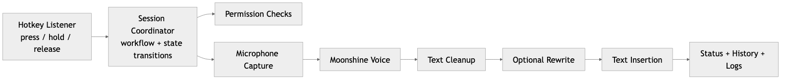
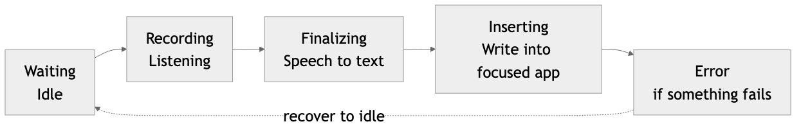
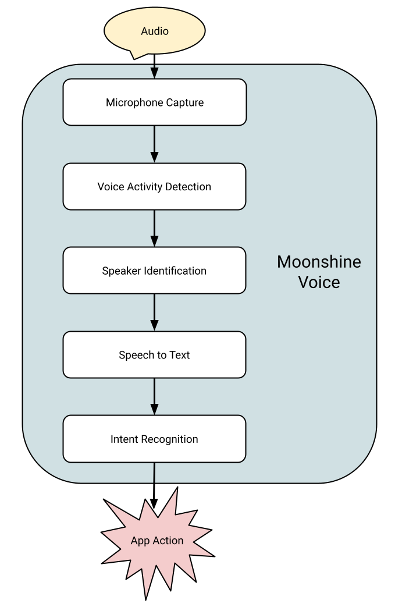
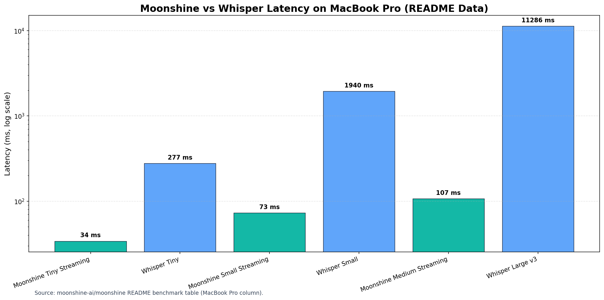
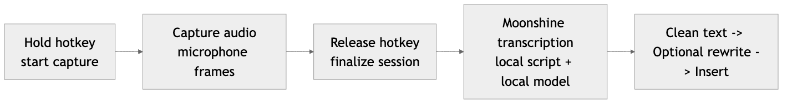
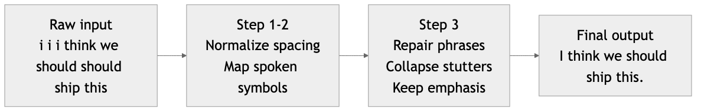
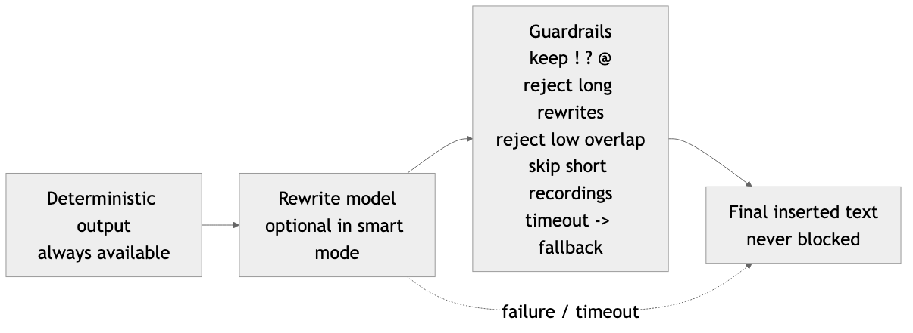
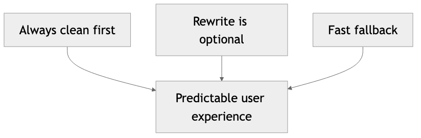

<!-- _class: lead -->

# Murmur
## Local-first dictation that feels instant

### What this talk covers
- System architecture
- Moonshine Voice: what it is and how it works
- Cleaning pipeline and optional rewrite model

---

## Agenda

1. Product experience in one minute
2. Architecture and reliability design
3. Moonshine Voice deep dive
4. Cleaning pipeline and rewrite safety
5. Demo flow

---

## The Product Loop

Hold shortcut -> Speak -> Release -> Text appears

Why this is hard:
- Must feel fast
- Must work across apps
- Must recover safely when something fails

---

## Murmur Architecture (Visual)

---

## Runtime Reliability Model

---

## Moonshine Voice: What It Is

- Open-source toolkit for live voice interfaces
- Designed for on-device speech recognition
- Optimized for low-latency streaming use cases

---

## Moonshine Voice: How It Works

- Audio enters through microphone capture
- Voice activity detection segments speech in real time
- Speech-to-text + intent stages produce app actions

Source: Moonshine open-source architecture diagram.

---

## Why We Chose Moonshine for Murmur

---

## How Murmur Uses Moonshine in Practice

---

## Deterministic Cleaning Pipeline

---

## Cleaning Examples (Before -> After)

- `i i i think we should should ship this`
  -> `I think we should ship this.`

- `send it tomorrow scratch that send it friday`
  -> `Send it friday.`

- `send this to jane at sign example.com`
  -> `Send this to jane@example.com.`

---

## Optional Rewrite Model With Guardrails

---

## What "Safe by Default" Means Here

---

## Demo Plan (Live)

1. Show press-hold-release insertion loop
2. Show one noisy input cleaned to stable text
3. Toggle deterministic mode vs smart mode
4. Show logs for timing and insertion path

---

## Takeaways

- Murmur is designed as a reliable real-time system
- Moonshine gives a strong local speech-recognition backbone
- Deterministic cleanup provides predictable quality
- The rewrite layer adds polish without risking core behavior

---

## Q&A

Thanks.
